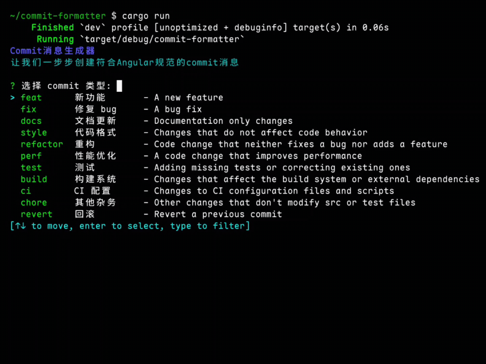

<h1 align="center"> Commit Formatter </h1>

<p align="center"> 一个用 Rust 编写的命令行工具，帮助用户生成符合 Angular 规范的 Git commit 消息 </p>

> [!NOTE]
> 对于 Windows 系统，我们发现在 Git Bash 和 CMD 使用本工具时会出现不同程度的问题，我们正在寻找一种兼容的方案，在此之前，我们推荐您通过 Powershell 或 Terminal 来使用本工具



---

## 功能特性

- 交互式界面，引导用户逐步创建 commit 消息
- 支持完整的 Angular commit 规范
- 输入验证，确保 commit 消息质量
- 可选择直接执行 git commit 命令

---

## 安装

### 方式一：下载预编译的二进制文件

1. 从 [Releases](https://github.com/YuleBest/commit-formatter/releases) 页面下载适合你操作系统的预编译二进制文件，截至 `v1.0.0` 版本，此方法支持了：

| Windows |       Linux       |  macOS  | Android |
| :-----: | :---------------: | :-----: | :-----: |
|  `x64`  | `x64`  `x64-musl` |  `x64`  |         |
|  `x86`  |                   |         |         |
|         |      `arm64`      | `arm64` | `arm64` |

2. 将可执行文件的所在目录添加到系统的 PATH 环境变量中，可在任意位置直接使用 `commit-formatter` 命令（可选）

3. 你可以将可执行文件改名为 `cf` 或其他你喜欢的简称，方便你的使用（可选）

### 方式二：从源码编译

1. 确保你已经安装了 Rust 和 Cargo，然后：

```bash
git clone https://github.com/YuleBest/commit-formatter.git
cd commit-formatter
cargo build --release
```

编译完成后，可执行文件位于 `target/release/` 目录下。

---

## 使用方法

### 交互式模式

直接运行程序进入交互式模式：

```bash
commit-formatter
```

或者显式指定交互式模式：

```bash
commit-formatter --interactive
commit-formatter -i
```

### 使用流程

1. **选择 commit 类型**：从预定义的 Angular 规范类型中选择
2. **输入作用域** (可选)：指定此次更改影响的模块或组件
3. **输入简短描述**：描述此次更改，不超过 50 个字符
4. **输入详细描述** (可选)：支持多行输入，详细解释更改的动机和实现方式
5. **输入破坏性变更** (可选)：描述不兼容的 API 变更
6. **输入关联 issue** (可选)：关联相关的 issue 编号
7. **执行生成的 `git commit` 命令** (可选)：若您的当前目录不位于一个 `git` 仓库，则执行会失败

### 多行详细描述

工具支持多行详细描述输入：
- 逐行输入详细描述内容
- 输入空行结束多行输入
- 生成的 `git` 命令会为每行使用单独的 `-m` 参数
- 确保 commit 消息格式正确且易于阅读

### 示例

```
feat(auth): add user authentication system

Implement JWT-based authentication with login and logout functionality.
Add middleware for protecting routes and user session management.

BREAKING CHANGE: Authentication is now required for all API endpoints

Closes #123
Closes #456
```

对应的 `git` 命令：

```bash
git commit -m "feat(auth): add user authentication system" -m "" -m "Implement JWT-based authentication with login and logout functionality." -m "Add middleware for protecting routes and user session management." -m "" -m "BREAKING CHANGE: Authentication is now required for all API endpoints" -m "" -m "Closes #123" -m "Closes #456"
```

---

## 附录

### Angular Commit 规范

| 类型      | 中文含义     | 英文说明                                      |
|-----------|--------------|-----------------------------------------------|
| **feat**  | 新功能       | A new feature                                 |
| **fix**   | 修复 bug     | A bug fix                                     |
| **docs**  | 文档         | Documentation only changes                    |
| **style** | 代码格式     | Changes that do not affect code behavior (e.g. formatting, missing semicolons, etc.) |
| **refactor** | 代码重构 | A code change that neither fixes a bug nor adds a feature |
| **perf**  | 性能优化     | A code change that improves performance       |
| **test**  | 添加测试     | Adding missing tests or correcting existing ones |
| **build** | 构建系统     | Changes that affect the build system or external dependencies (e.g. webpack, npm) |
| **ci**    | 持续集成配置 | Changes to CI configuration files and scripts (e.g. GitHub Actions, Travis, Circle) |
| **chore** | 杂务         | Other changes that don't modify src or test files |
| **revert**| 回滚         | Reverts a previous commit                     |

> - 所有 commit 都应遵循格式：`<type>(<scope>): <subject>`
> - 示例：`feat(login): 添加用户登录功能`

---

### CI/CD 和自动构建

本项目使用 GitHub Actions 进行持续集成和自动构建 (`.github/workflows/build.yml`)：

- 支持多个目标平台的交叉编译
- 自动生成各平台的可执行文件
- 在创建 tag 时自动创建 GitHub Release

---

### 加入开发

欢迎提交 Issue 和 Pull Request 来改进这个工具！

在提交代码前，请确保：
- 运行 `cargo fmt` 格式化代码
- 运行 `cargo test` 确保测试通过

---

### 许可证

[Yule License 1.0.0](./LICENSE.txt)